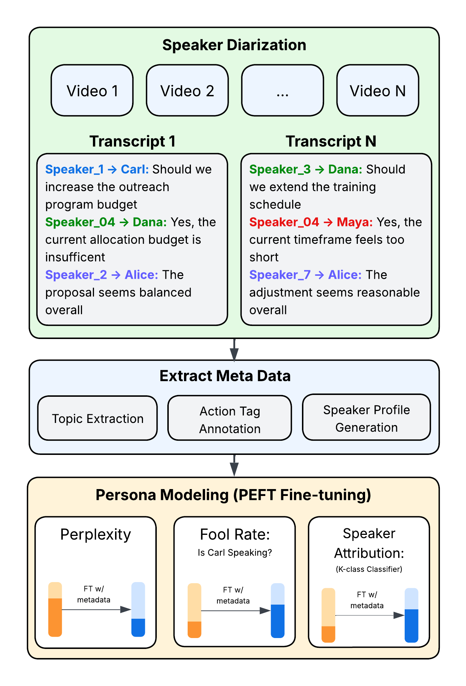
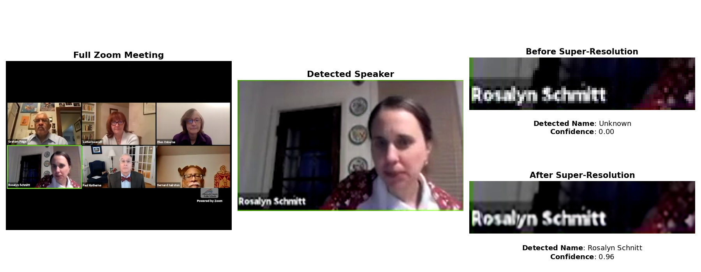

# Action-Aware LLMs for Realistic Simulation of Local Government Meetings

This repository accompanies the paper:  
**_“Action-Aware LLMs for Realistic Simulation of Local Government Meetings”_**, which introduces a multimodal framework for transforming real-world meeting videos into **speaker-linked, metadata-enriched transcripts**.  This enables the fine-tuning of **language models** and the creation of hyper-realistic deliberative interactions.

---

## Abstract

Large language models (LLMs) offer unprecedented opportunities to simulate multi-party deliberation in real-world settings, but realistic persona-aware modeling has been limited by the lack of speaker-attributed data and structured procedural information. This work presents a complete, reproducible pipeline for collecting, processing, and modeling multi-speaker deliberations. Publicly available Zoom recordings are transformed into speaker-attributed transcripts using multimodal diarization, and enriched with structured metadata including personas, agenda topics, and turn-level action tags. Parameter-efficient fine-tuning enables LLMs to generate dialogue that is both plausible and consistent with individual speaker styles. Evaluation across three newly released local government datasets—school board, municipal council, and appellate court meetings—demonstrates substantial reductions in perplexity, increased classifier-based fooling, and improved speaker-attribution accuracy. Human studies confirm that simulations are largely indistinguishable from real interactions, and temporal guidance enhances procedural coherence. The results provide a practical recipe for researchers to collect large-scale data, validate models, and run hyper-realistic simulations of real-world deliberative processes.

---

## Framework Overview

  

**Figure 1.** Overview of the framework for generating hyperrealistic deliberation simulations. The system operates in three stages: (1) **Speaker Diarization** leverages visual cues from Zoom recordings to convert raw multi-speaker meetings into speaker-linked transcripts; (2) **Metadata Extraction** enriches these transcripts with structured annotations such as action tags, topic labels, and persona profiles; and (3) **Persona Modeling** fine-tunes language models on the enriched data to enhance performance across key metrics—perplexity (PPL), classifier fool rate (CFR), and speaker attribution accuracy (SAA).

---

## Diarization Process

The diarization pipeline links anonymized ASR outputs to speaker identities based on timestamp alignment and meeting metadata. This process is critical for creating consistent, speaker-linked transcripts.

  

**Figure 2.** Video-based speaker diarization for Zoom meetings: The system detects the active speaker via the highlighted video tile, crops the participant’s name region, and applies OCR to identify the speaker. If OCR confidence is below 80\%, the crop is enhanced with a super-resolution model (EDSR) before reapplying OCR. This produces a per-second speaker identity signal, which is then aligned with audio transcripts for accurate, time-stamped, speaker-attributed transcripts.

---

## Module Descriptions

### `Analysis/`
Contains evaluation notebooks for assessing model performance across key metrics:

- **`analysis_fool_rates.ipynb`** – Computes and visualizes *Classifier Fool Rate (CFR)*, quantifying how often a model-generated utterance is indistinguishable from a real one.  
- **`analysis_perplexity.ipynb`** – Measures linguistic fluency using standard *perplexity* metrics.  
- **`analysis_speaker_attribution.ipynb`** – Evaluates identity consistency via *Speaker Attribution Accuracy (SAA)*.

---

### `Data Processing/`
Implements the end-to-end multimodal diarization and transcription pipeline:

- **`zoomDiarization.py`** – Produces a time-stamped list of speaker turns along with identified speaker names extracted from Zoom meeting metadata.  
- **`whisperTranscription.py`** – Generates automatic speech recognition (ASR) transcripts using OpenAI’s Whisper model.  
- **`make_transcript.ipynb`** – Aligns anonymous speaker labels from `whisperTranscription.py` with identity-linked names from `zoomDiarization.py` by matching timestamps of utterances and speaker changes.

---

### `Datasets/`
Contains curated, speaker-linked deliberation datasets:

- **`Albermale/`**, **`DCAppeals/`**, and **`Waipa/`** – Transcripts from three real-world government forums: a school board, an appellate court, and a municipal council.  
- Each folder includes `.npy` transcript arrays with time-aligned, speaker-linked dialogue segments.  
- Files are named according to their corresponding YouTube videos. You can view each source video by visiting:  
  `https://www.youtube.com/watch?v={VIDEO_ID}`  
- **`dataset_example.ipynb`** – Demonstrates dataset structure, loading, and preprocessing steps.

---

### `Scripts/`
Core training and simulation scripts:

- **`train_agent.py`** – Fine-tunes large language models on speaker-linked transcripts to generate persona-consistent dialogue.  
- **`train_fool_rate.py`** – Trains models for *Classifier Fool Rate (CFR)* evaluation.  
- **`train_SAA.py`** – Trains models for *Speaker Attribution Accuracy (SAA)* evaluation.  
- **`simulate.py`** – Runs full deliberation simulations given meeting contexts and defined personas.  
- **`eval_test_set.py`**, **`eval_perplexity.py`** – Evaluate model outputs on held-out transcripts for accuracy and fluency.  
- **`utils.py`** – Shared utilities for data loading, preprocessing, and model management.

---

## Citation

If you use this code or dataset, please cite:

@inproceedings{TODO,
title={Action-Aware LLMs for Realistic Simulation of Local Government Meetings},
author={Scott Merrill and Shashank Srivastava},
booktitle={TODO},
year={2026}
}

---

## Contact

For questions or collaboration inquiries, please contact:  
**Scott Merrill** – [smerrill@unc.edu]  
or open an issue on GitHub.